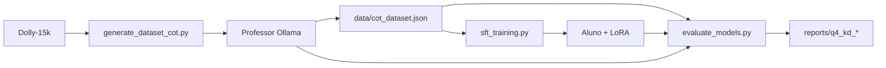

# Q4 — Destilação de Conhecimento (Knowledge Distillation)

Pipeline completa para transferir conhecimento de **professores** grandes (via Ollama) para **alunos** menores (via Hugging Face + LoRA), usando o dataset [`databricks/databricks-dolly-15k`](https://huggingface.co/datasets/databricks/databricks-dolly-15k).

## Estrutura de Pastas

```
q4-knowledge_distillation/
├── config.py                  # Configuração central (professores, alunos, paths, templates)
├── generate_dataset_cot.py    # Gera dataset CoT a partir dos professores (Ollama)
├── sft_training.py            # Fine-tuning LoRA do aluno (formato Alpaca)
├── evaluate_models.py         # Avaliação com 4 métricas + comparação teacher/student
├── README.md                  # Esta documentação
├── benchmark_kd.json          # Benchmark gerado (prompt, reasoning, answer)
├── data/
│   ├── cot_dataset.json       # Dataset final Alpaca + CoT
│   └── cot_dataset_checkpoint.jsonl  # Checkpoint incremental da geração
└── models/
    ├── qwen2.5-7b_sft/        # Adaptadores LoRA por aluno
    ├── qwen3.5-2b_sft/
    └── qwen2.5-1.5b_sft/
```

Relatórios salvos em `reports/q4_kd_evaluation_report.md` e `reports/q4_kd_evaluation.json`.

---

## Modelos Configurados

### Professores (Teachers) — Ollama local

| Chave | Modelo Ollama | Descrição |
|-------|---------------|-----------|
| `qwen3-14b` | `qwen3:14b` | Professor principal |
| `gemma3-12b` | `gemma3:12b` | Professor alternativo |

### Alunos (Students) — Hugging Face + LoRA

| Chave | Modelo HF | Pasta LoRA |
|-------|-----------|------------|
| `qwen2.5-7b` | `Qwen/Qwen2.5-7B-Instruct` | `models/qwen2.5-7b_sft` |
| `qwen3.5-2b` | `Qwen/Qwen3.5-2B-Base` | `models/qwen3.5-2b_sft` |
| `qwen2.5-1.5b` | `Qwen/Qwen2.5-1.5B-Instruct` | `models/qwen2.5-1.5b_sft` |

Para trocar modelos, edite `config.py` ou use as flags `--teacher` / `--student` nos scripts.

---

## Pré-requisitos

```bash
# Dependências do projeto (raiz)
pip install -r requirements.txt

# Para geração via Ollama
pip install requests datasets tqdm openai

# Ollama com os professores baixados
ollama pull qwen3:14b
ollama pull gemma3:12b
```

Certifique-se de que o Ollama está rodando (`http://localhost:11434`).

---

## Formato dos Dados

### Dataset SFT (Alpaca + CoT)

Gerado por `generate_dataset_cot.py`:

```json
{
  "instruction": "Qual é a capital da França?",
  "input": "",
  "output": "### Raciocínio:\nParis é a capital desde...\n\n### Resposta:\nParis"
}
```

O treino (`sft_training.py`) formata isso no template Alpaca padrão (mesmo estilo de `q2_q3-post_training`).

### Benchmark de Avaliação

Gerado automaticamente por `evaluate_models.py` a partir do dataset CoT:

```json
{
  "prompt": "Qual é a capital da França?",
  "input": "",
  "reasoning": "Paris é a capital desde...",
  "answer": "Paris",
  "reference_output": "### Raciocínio:\n...\n\n### Resposta:\nParis"
}
```

---

## Pipeline — Passo a Passo

### 1. Gerar dataset CoT com o professor

```bash
# Professor padrão (qwen3-14b)
python q4-knowledge_distillation/generate_dataset_cot.py --target_count 1000

# Professor alternativo
python q4-knowledge_distillation/generate_dataset_cot.py --teacher gemma3-12b --target_count 1000

# Filtrar categorias do Dolly
python q4-knowledge_distillation/generate_dataset_cot.py --categories closed_qa open_qa
```

**Checkpointing:** se interrompido, rode o mesmo comando — o progresso em `data/cot_dataset_checkpoint.jsonl` é retomado automaticamente.

### 2. Fine-tuning do aluno (SFT)

```bash
# Aluno padrão (qwen3.5-2b)
python q4-knowledge_distillation/sft_training.py --student qwen3.5-2b

# Outros alunos
python q4-knowledge_distillation/sft_training.py --student qwen2.5-7b
python q4-knowledge_distillation/sft_training.py --student qwen2.5-1.5b

# Com QLoRA 4-bit (VRAM limitada)
python q4-knowledge_distillation/sft_training.py --student qwen3.5-2b --load_in_4bit
```

### 3. Avaliar professores e alunos

```bash
# Comparação completa: ambos professores + aluno baseline + aluno pós-SFT
python q4-knowledge_distillation/evaluate_models.py --mode compare_all --student qwen3.5-2b

# Apenas um professor
python q4-knowledge_distillation/evaluate_models.py --mode teacher --teacher qwen3-14b

# Apenas aluno (baseline + pós-SFT)
python q4-knowledge_distillation/evaluate_models.py --mode student --student qwen2.5-7b
```

---

## Métricas de Avaliação

| Métrica | Descrição | Professores | Alunos |
|---------|-----------|:-----------:|:------:|
| **Cross-Entropy Loss** | Perda no split de validação (10%) | — | ✅ |
| **Perplexidade (PPL)** | `exp(loss)` no split de validação | — | ✅ |
| **Top-1 Accuracy** | % tokens da resposta gold no top-1 | — | ✅ |
| **Top-5 Accuracy** | % tokens da resposta gold no top-5 | — | ✅ |
| **Answer Match Rate** | Match normalizado da resposta final | ✅ | ✅ |

> Professores via Ollama não expõem logits para Top-k token-level; usam **Answer Match Rate** como métrica principal.

---

## Parâmetros Principais

### `generate_dataset_cot.py`

| Parâmetro | Padrão | Descrição |
|-----------|--------|-----------|
| `--teacher` | `qwen3-14b` | Chave do professor em `config.TEACHERS` |
| `--dataset` | `databricks/databricks-dolly-15k` | Dataset fonte |
| `--target_count` | `1000` | Exemplos CoT a gerar |
| `--output` | `data/cot_dataset.json` | JSON final Alpaca + CoT |
| `--api_url` | `http://localhost:11434` | URL do Ollama |

### `sft_training.py`

| Parâmetro | Padrão | Descrição |
|-----------|--------|-----------|
| `--student` | `qwen3.5-2b` | Chave do aluno |
| `--dataset_path` | `data/cot_dataset.json` | Dataset CoT |
| `--epochs` | `3` | Épocas de treino |
| `--load_in_4bit` | off | Ativa QLoRA |

### `evaluate_models.py`

| Parâmetro | Padrão | Descrição |
|-----------|--------|-----------|
| `--mode` | `compare_all` | `teacher`, `student` ou `compare_all` |
| `--benchmark_json` | `benchmark_kd.json` | Benchmark (100 itens) |
| `--skip_baseline` | off | Pula aluno pré-SFT |
| `--skip_sft` | off | Pula aluno pós-SFT |

---

## Diferenças em relação a `q2_q3-post_training`

| Aspecto | Q2/Q3 | Q4 |
|---------|-------|-----|
| Dataset fonte | `vickminari/docentesDC` | `databricks/databricks-dolly-15k` |
| Geração | Perguntas a partir de chunks | CoT (raciocínio + resposta) |
| Modelo gerador | Ollama/vLLM genérico | Professores fixos via Ollama |
| Formato output | Resposta direta | `### Raciocínio:` + `### Resposta:` |
| Avaliação | PPL + qualitativo | PPL + Loss + Top-1 + Top-5 + Match |
| Benchmark | `instruction/input/output` | `prompt/reasoning/answer` |
| Config central | CLI apenas | `config.py` |

---

## Fluxo Resumido


