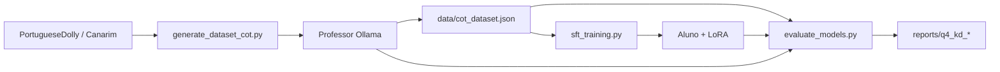

# Q4 — Destilação de Conhecimento (Knowledge Distillation)

Pipeline para transferir conhecimento de **professores** grandes (via Ollama) para **alunos** menores (via Hugging Face + LoRA), usando datasets de instrução em **português**.

Dataset padrão: [`botbotrobotics/PortugueseDolly`](https://huggingface.co/datasets/botbotrobotics/PortugueseDolly) (tradução pt-BR do Dolly-15k).

---

## Estrutura de Pastas

```
q4-knowledge_distillation/
├── config.py                  # Configuração central (professores, alunos, presets de dataset)
├── generate_dataset_cot.py    # Gera dataset CoT a partir dos professores (Ollama)
├── sft_training.py            # Fine-tuning LoRA do aluno (formato Alpaca)
├── evaluate_models.py         # Avaliação com 4 métricas + comparação teacher/student
├── requirements.txt           # Dependências específicas da Q4
├── README.md
├── benchmark_kd.json          # Benchmark gerado (prompt, reasoning, answer)
├── data/
│   ├── cot_dataset.json
│   └── cot_dataset_checkpoint.jsonl
└── models/
    ├── qwen2.5-7b_sft/
    ├── qwen3.5-2b_sft/
    └── qwen2.5-1.5b_sft/
```

Relatórios em `reports/q4_kd_evaluation_report.md` e `reports/q4_kd_evaluation.json`.

---

## Datasets Fonte (presets)

A arquitetura da pipeline é a mesma; troque o preset com `--dataset_preset`:

| Preset | Repositório HF | Descrição |
|--------|----------------|-----------|
| `portuguese_dolly` **(padrão)** | `botbotrobotics/PortugueseDolly` | Dolly-15k em pt-BR (~15k) |
| `canarim` | `dominguesm/Canarim-Instruct-PTBR-Dataset` | Instruções nativas em PT (~316k) |

### Mapeamento de campos por preset

| Campo interno | `portuguese_dolly` | `canarim` |
|---------------|--------------------|-----------|
| Instrução | `instruction` | `instruction` |
| Contexto | `context` (fallback: `input`) | `context` (fallback: `input`) |
| Resposta | `response` | `output` |
| Categoria | `category` | `general` (sem campo) |

O mapeamento é feito automaticamente por `normalize_source_row()` em `config.py`.

---

## Modelos

### Professores (Ollama)

| Chave | Modelo Ollama |
|-------|---------------|
| `qwen3-14b` | `qwen3:14b` |
| `gemma3-12b` | `gemma3:12b` |

```bash
ollama pull qwen3:14b
ollama pull gemma3:12b
```

### Alunos (Hugging Face + LoRA)

| Chave | Modelo HF | Pasta LoRA |
|-------|-----------|------------|
| `qwen2.5-7b` | `Qwen/Qwen2.5-7B-Instruct` | `models/qwen2.5-7b_sft` |
| `qwen3.5-2b` | `Qwen/Qwen3.5-2B-Base` | `models/qwen3.5-2b_sft` |
| `qwen2.5-1.5b` | `Qwen/Qwen2.5-1.5B-Instruct` | `models/qwen2.5-1.5b_sft` |

---

## Instalação

```bash
# 1. PyTorch com CUDA (ex.: CUDA 12.8 → cu128)
pip install torch torchvision torchaudio --index-url https://download.pytorch.org/whl/cu128

# 2. Dependências da Q4
pip install -r q4-knowledge_distillation/requirements.txt
```

Verifique a GPU:

```bash
python3 -c "import torch; print(torch.__version__); print(torch.cuda.is_available())"
```

---

## Formato dos Dados

### Dataset SFT gerado (Alpaca + CoT)

```json
{
  "instruction": "Qual é a capital da França?",
  "input": "",
  "output": "### Raciocínio:\nParis é a capital desde...\n\n### Resposta:\nParis"
}
```

### Benchmark de avaliação

```json
{
  "prompt": "Qual é a capital da França?",
  "input": "",
  "reasoning": "Paris é a capital desde...",
  "answer": "Paris",
  "reference_output": "### Raciocínio:\n...\n\n### Resposta:\nParis"
}
```

---

## Pipeline — Passo a Passo

### 1. Gerar dataset CoT

```bash
# Padrão: PortugueseDolly + professor qwen3-14b
python q4-knowledge_distillation/generate_dataset_cot.py --target_count 1000

# Canarim (português nativo; mapeia output → response)
python q4-knowledge_distillation/generate_dataset_cot.py \
  --dataset_preset canarim \
  --target_count 1000

# Professor alternativo
python q4-knowledge_distillation/generate_dataset_cot.py \
  --teacher gemma3-12b \
  --target_count 1000

# Filtrar categorias (portuguese_dolly)
python q4-knowledge_distillation/generate_dataset_cot.py \
  --categories closed_qa open_qa
```

**Checkpointing:** se interrompido, rode o mesmo comando — `data/cot_dataset_checkpoint.jsonl` retoma automaticamente.

**Background (nohup):**

```bash
mkdir -p logs
nohup python3 q4-knowledge_distillation/generate_dataset_cot.py \
  --target_count 1000 \
  > logs/q4_cot.log 2>&1 &
echo $!
tail -f logs/q4_cot.log
```

### 2. Fine-tuning do aluno (SFT)

```bash
python q4-knowledge_distillation/sft_training.py --student qwen3.5-2b
python q4-knowledge_distillation/sft_training.py --student qwen2.5-7b --load_in_4bit
python q4-knowledge_distillation/sft_training.py --student qwen2.5-1.5b
```

### 3. Avaliar professores e alunos

```bash
python q4-knowledge_distillation/evaluate_models.py \
  --mode compare_all \
  --student qwen3.5-2b
```

---

## Métricas

| Métrica | Professores | Alunos |
|---------|:-----------:|:------:|
| Cross-Entropy Loss | — | ✅ |
| Perplexidade (PPL) | — | ✅ |
| Top-1 Accuracy | — | ✅ |
| Top-5 Accuracy | — | ✅ |
| Answer Match Rate | ✅ | ✅ |

---

## Parâmetros — `generate_dataset_cot.py`

| Parâmetro | Padrão | Descrição |
|-----------|--------|-----------|
| `--dataset_preset` | `portuguese_dolly` | `portuguese_dolly` ou `canarim` |
| `--dataset` | *(do preset)* | Sobrescreve o repositório HF ou caminho local |
| `--teacher` | `qwen3-14b` | Professor Ollama |
| `--target_count` | `1000` | Exemplos CoT a gerar |
| `--output` | `data/cot_dataset.json` | JSON final |
| `--categories` | todas | Filtro de categorias (Dolly) |

---

## Diferenças em relação a `q2_q3-post_training`

| Aspecto | Q2/Q3 | Q4 |
|---------|-------|-----|
| Dataset fonte | `docentesDC` | `PortugueseDolly` ou `Canarim` |
| Geração | Perguntas de chunks | CoT (raciocínio + resposta) |
| Modelo gerador | Qualquer Ollama | Professores fixos (14B / 12B) |
| Formato output | Resposta direta | `### Raciocínio:` + `### Resposta:` |
| Avaliação | PPL + qualitativo | PPL + Loss + Top-1 + Top-5 + Match |
| Config | CLI | `config.py` + presets de dataset |

---

## Fluxo


