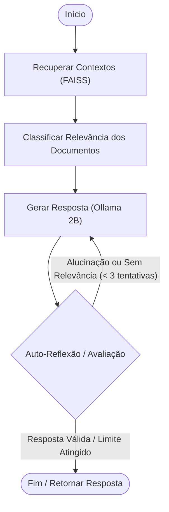

# Questão 5 — Pipeline de Avaliação RAG (Self-Reflective RAG)

Este diretório contém a implementação completa do pipeline de avaliação de RAG (Retrieval-Augmented Generation) local para o dataset **docentesDC**. 

A solução utiliza uma abordagem de **Self-Reflective RAG** construída com **LangGraph**, buscando chunks relevantes no banco vetorial local **FAISS** (gerados com o modelo de embeddings **`BAAI/bge-m3`**) e executando reflexões de corretude com o modelo local **`qwen3.5:2b`** via **Ollama**. A avaliação quantitativa é realizada através da biblioteca **RAGAS** usando o **`qwen3.5:9b`** como juiz.

---

## 🛠️ Arquitetura do Pipeline

O pipeline de auto-reflexão (**Self-Reflective RAG**) segue o fluxo descrito no grafo abaixo:



1. **Retrieve:** Busca os 4 chunks de documentos mais próximos da pergunta utilizando o banco FAISS e embeddings `BAAI/bge-m3`.
2. **Grade Documents:** Um avaliador rápido do `qwen3.5:2b` filtra chunks de contextos irrelevantes para a pergunta.
3. **Generate:** O modelo gera a resposta usando apenas os contextos que passaram no filtro de relevância.
4. **Self-Reflection (Avaliador de Alucinação e Utilidade):**
   * *Verificação de Alucinação:* Garante que a resposta gerada está estritamente fundamentada no contexto (evitando invenções).
   * *Verificação de Utilidade:* Garante que o modelo respondeu diretamente à dúvida do usuário de forma útil.
   * Se falhar em algum dos critérios, o modelo refaz a geração (limite de 3 tentativas).

---

## 📋 Pré-requisitos e Instalação

### 1. Dependências do Python
Garanta que as bibliotecas necessárias estão instaladas no ambiente virtual (`venv`):

```bash
pip install langchain langchain-community langchain-ollama langgraph faiss-cpu sentence-transformers ragas datasets tqdm
```

### 2. Ollama Local
Certifique-se de que o Ollama está em execução localmente com os seguintes modelos baixados:

```bash
# Executa os modelos para garantir que estão baixados e prontos
ollama run qwen3.5:2b
ollama run qwen3.5:9b
```

---

## 🚀 Passo a Passo de Execução

Siga os passos abaixo, em ordem, a partir do diretório raiz da questão (`trabalho_final/qwen-finetuning-rag-project/`):

### Passo 1: Preparar o Benchmark de Testes
Seleciona **30 perguntas e respostas de referência** de forma distribuída a partir do dataset de SFT `perguntas_docentes.json`:

```bash
python .\q5-rag_evaluation\prepare_benchmark.py
```
* **Saída gerada:** `q5-rag_evaluation/benchmark_rag_30.json`

### Passo 2: Construir o Banco Vetorial (Indexação)
Carrega o arquivo completo de dados dos docentes (`docentesDC.jsonl`), realiza o chunking semântico e gera os embeddings usando o modelo local `BAAI/bge-m3`:

```bash
python .\q5-rag_evaluation\prepare_vector_store.py
```
* **Nota sobre a execução:** O script exibe uma barra de progresso (`tqdm`) para acompanhar o andamento.
* **Saída gerada:** Cria a pasta `q5-rag_evaluation/faiss_index/` contendo `index.faiss` e `index.pkl`.
* *Dica:* Se notar gargalos de VRAM/paging na GPU devido ao Ollama, você pode abrir o script e ajustar a variável `device = "cpu"` na linha 50.

### Passo 3: Gerar os Resultados de Inferência
Executa as 30 perguntas do benchmark em duas configurações para comparar o desempenho:
1. **No-RAG (Sem RAG):** Respostas geradas diretamente pelo `qwen3.5:2b` sem acesso aos documentos de contexto.
2. **With-RAG (Com RAG):** Respostas geradas através do pipeline de Self-Reflective RAG com o agente LangGraph.

```bash
python .\q5-rag_evaluation\generate_results.py
```
* **Saídas geradas:** 
  * `q5-rag_evaluation/results_no_rag.json`
  * `q5-rag_evaluation/results_with_rag.json`

### Passo 4: Executar a Avaliação RAGAS
Carrega os resultados gerados nos dois cenários e calcula as seguintes métricas utilizando o `qwen3.5:9b` como juiz local:
* **Faithfulness (Fidelidade):** A resposta se baseia apenas no contexto fornecido?
* **Answer Relevance (Relevância da Resposta):** A resposta é útil e atende à pergunta direta?
* **Context Precision (Precisão do Contexto):** Os chunks recuperados eram realmente úteis?
* **Context Recall (Revocação do Contexto):** Todos os fatos necessários do ground truth foram capturados pelo recuperador?

```bash
python .\q5-rag_evaluation\evaluate_ragas.py
```
* **Saída gerada:** `reports/q5_ragas_evaluation.json`

---

## 📊 Relatório Final

Após a execução do pipeline de avaliação via RAGAS, as pontuações médias quantitativas e a análise qualitativa detalhada comparando as duas abordagens (No-RAG vs With-RAG) e a taxa de auto-correção do agente estarão compiladas e estruturadas em:
* q5_rag_evaluation_report.md
