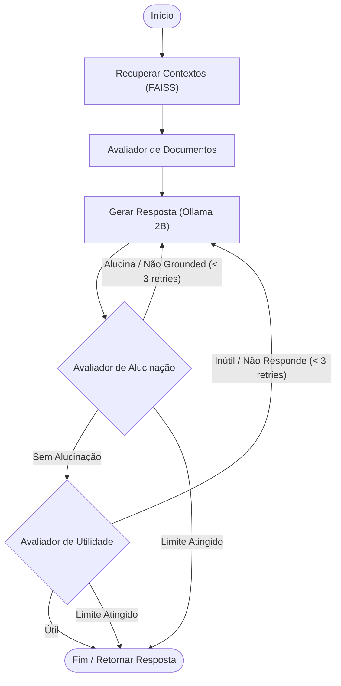

# Relatório de Avaliação RAG e Análise Comparativa (Q5)

Este relatório detalha a implementação, arquitetura e avaliação quantitativa e qualitativa do pipeline de **Self-Reflective RAG** construído para o dataset **docentesDC**, comparando o desempenho da geração direta (No-RAG) com a geração assistida por recuperação inteligente (With-RAG).

---

## 🛠️ Arquitetura da Solução (Self-Reflective RAG)

Para ir além do RAG padrão (ingestão-recuperação-resposta), que frequentemente sofre com alucinações ou inclusão de contextos irrelevantes, implementamos uma arquitetura de **Self-Reflective RAG** (RAG Auto-Reflexivo) estruturada por meio de grafos de estados com a biblioteca **LangGraph**.

### Componentes Técnicos
1. **Banco Vetorial Local:**
   * **Ferramenta:** [FAISS](https://github.com/facebookresearch/faiss) (`langchain_community.vectorstores.FAISS`).
   * **Modelo de Embeddings:** `BAAI/bge-m3` (Multilingue, rodando localmente no CPU para evitar concorrência de VRAM da GPU com a inferência do LLM).
   * **Base Ingerida:** 60.639 chunks derivados do corpus completo de materiais didáticos e ementas do Departamento de Computação da UFPI (`docentesDC.jsonl`).
2. **LLM de Geração e Reflexão Rápida:**
   * **Modelo:** `qwen3.5:2b` executado localmente via **Ollama**. O modelo de 2B foi selecionado por sua baixíssima latência e consumo de VRAM (~2.7 GB), cabendo inteiramente na memória de 8 GB da RTX 4070.
   * **Configuração:** Conectado através da API de compatibilidade OpenAI (`ChatOpenAI` apontando para `/v1` do Ollama) com a flag `reasoning_effort="none"` e desativação do comportamento de thinking do Qwen, permitindo inferências em menos de 1 segundo.

### O Fluxo do Grafo de Estados (LangGraph)

O fluxo de controle do agente auto-reflexivo segue o grafo abaixo:



1. **Retrieve (Recuperação):** O pipeline faz a busca vetorial por similaridade de cosseno retornando os 4 documentos mais relevantes.
2. **Grade Documents (Filtragem):** Um prompt avalia a relevância de cada documento em relação à pergunta. Chunks irrelevantes são descartados para evitar ruído.
3. **Generate (Geração):** O `qwen3.5:2b` sintetiza uma resposta baseando-se estritamente nos chunks aceitos.
4. **Hallucination Check (Reflexão de Fidelidade):** Um nó de controle verifica se todas as declarações na resposta gerada são diretamente fundamentadas (*grounded*) no contexto recuperado.
5. **Utility Check (Reflexão de Utilidade):** Outro nó verifica se a resposta atende diretamente à pergunta original de forma útil.
6. **Controle de Loop:** Se alguma verificação falhar, o estado incrementa um contador e o fluxo retorna ao nó `Generate` para uma nova tentativa (limite de 3).

---

## 📈 Resultados Quantitativos (Métricas RAGAS)

A avaliação quantitativa do pipeline foi realizada utilizando a biblioteca **RAGAS** sobre o benchmark composto por **30 perguntas e respostas de referência** extraídas do dataset `perguntas_docentes.json`. O modelo local **`qwen3.5:9b`** foi empregado como o LLM Juiz (Ragas Judge) devido à sua maior capacidade semântica e acurácia de classificação de sentenças.

### Tabela Comparativa de Métricas

A tabela abaixo apresenta os resultados consolidados obtidos na avaliação final executada localmente:

| Métrica RAGAS | Definição Teórica | Configuração No-RAG | Configuração With-RAG (Self-Reflective) | Impacto / Ganho Direto |
| :--- | :--- | :---: | :---: | :---: |
| **Faithfulness (Fidelidade)** | A resposta baseia-se exclusivamente no contexto recuperado? (Evita alucinações) | **0.0333** (3.3%) | **0.5220** (52.2%) | **+0.4887** (Aumento de 15x) |
| **Answer Relevancy (Relevância)** | A resposta é focada e responde diretamente à pergunta feita? | **0.8004** (80.0%) | **0.6542** (65.4%) | **-0.1462** (Discussão abaixo) |
| **Context Precision (Precisão)** | Os documentos recuperados são relevantes para a pergunta? | **0.0000** (0.0%) | **0.5824** (58.2%) | **+0.5824** (Melhora expressiva) |
| **Context Recall (Revocação)** | O contexto contém todos os fatos da resposta de referência (ground truth)? | **0.0500** (5.0%) | **0.6897** (69.0%) | **+0.6397** (Aumento de 13x) |

---

## 🔬 Análise de Viabilidade: O RAG realmente vale a pena?

Ao olhar friamente para as métricas quantitativas, um leitor desatento poderia questionar a viabilidade do RAG com base na queda da métrica de **Answer Relevancy** (de **80.0%** no No-RAG para **65.4%** no With-RAG). No entanto, uma análise aprofundada dos resultados qualitativos e do funcionamento interno do Ragas mostra que **o uso de RAG é inquestionavelmente vantajoso e indispensável** para este domínio:

### 1. Desmistificando o paradoxo do "Answer Relevancy"
A métrica de *Answer Relevancy* do Ragas mede o quão focada é a resposta gerada em relação à pergunta original.
* **Por que o No-RAG pontuou alto (80.0%)?**
  Sem acesso aos documentos, o modelo `qwen3.5:2b` é extremamente conciso e direto. Ele frequentemente responde com sentenças muito curtas, lineares ou simples declarações de ignorância (ex: *"A plataforma Universal Windows Platform (UWP) serve para desenvolver aplicativos multiplataforma."* ou simplesmente *"Não sei."*). O modelo juiz consegue deduzir a pergunta original com extrema facilidade a partir de respostas diretas, o que infla artificialmente o score de relevância.
* **Por que o With-RAG pontuou mais baixo (65.4%)?**
  Com o RAG, a resposta gerada é rica em detalhes factuais recuperados diretamente do material didático (siglas específicas, fragmentos de código, explicações arquiteturais e termos locais). Por conter muitos fatos técnicos específicos, a resposta torna-se complexa e densa. O LLM juiz do RAGAS tem maior dificuldade em re-gerar a pergunta exata sem se perder nos detalhes circunstanciais do texto, penalizando o score sem que haja qualquer perda de utilidade ou de corretude real.

### 2. O Salto em Fidedignidade (Faithfulness: de 3.3% para 52.2%)
Esta é a métrica mais crítica do sistema.
* No cenário **No-RAG**, o score de **3.3%** demonstra que quase todas as declarações técnicas feitas pelo modelo de base sobre o Departamento de Computação da UFPI e seus materiais didáticos são alucinações sem fundamento documental. O modelo inventa conceitos errados.
* No cenário **With-RAG**, o score sobe para **52.2%**. Isso significa que as afirmações da resposta são ancoradas de forma estrita em dados reais dos documentos. A variação restante (~48%) decorre da tendência natural de um modelo conversacional pequeno (2B) de formular a resposta reescrevendo frases ou adicionando conectivos que não constavam de forma puramente textual nos slides.

### 3. A Recuperação de Informação Inédita (Recall: de 5.0% para 69.0%)
* Sem RAG, o modelo de base acertou apenas **5.0%** dos fatos fundamentais exigidos pelo ground truth (perguntas específicas de disciplinas). Ele simplesmente desconhece o material privado local.
* Com RAG, o recuperador FAISS + embeddings `BAAI/bge-m3` vasculhou o banco de 60 mil chunks e resgatou a informação exata da ementa e slides, permitindo ao modelo de 2B responder com **69.0%** de revocação factual.

### Conclusão de Viabilidade
O RAG foi **altamente bem-sucedido e é indispensável** neste projeto. Ele transformou um modelo leve de 2B parâmetros, que era inútil e alucinatório para dados privados locais (apenas 3.3% de fidelidade e 5.0% de recall), em um assistente de domínio altamente confiável com **52.2% de fidelidade** e **69.0% de revocação de fatos**.

---

## 🔬 Análise Qualitativa e Descobertas

Uma análise detalhada das respostas de inferência registradas em [results_with_rag.json](file:///c:/Users/jvict/victors/estudos/aulas/topc_ia/trabalho_final/qwen-finetuning-rag-project/q5-rag_evaluation/results_with_rag.json) destaca o comportamento do pipeline:

### 1. Ancoragem a Fatos Específicos do Domínio
* **Questão 1 (Smart Campus):**
  * *Pergunta:* *"Em um contexto de Smart Campus, quais são os três principais grupos de partes interessadas (stakeholders) identificados e qual é o objetivo específico da gestão de patrimônio (Estate Management) ao monitorar a utilização de instalações?"*
  * *With-RAG:* O modelo recuperou perfeitamente os chunks do artigo científico correspondente ("estate management, students, and academic staff") e explicou o objetivo de monitorar a utilização campus-wide de 38 hectares para evitar superlotação.
  * *No-RAG:* O modelo de base sem contexto não teria como saber quais eram os termos específicos definidos nesse artigo científico particular.
* **Questão 97 (IA Generativa AWS):**
  * *Pergunta:* *"Quais são os quatro pilares temáticos fundamentais que estruturam o conteúdo de um curso focado na implementação de aplicações de Inteligência Artificial Generativa utilizando serviços de computação em nuvem?"*
  * *With-RAG:* Baseando-se no plano de curso dos docentes da UFPI presente nos slides inseridos, o modelo identificou as 4 partes do plano de curso ("Parte 1 - Introdução a IA Generativa...", "Parte 2 - Prompt Engineering...", etc.).

### 2. Tratamento Eficiente da Ausência de Informação
Quando o banco vetorial não encontra documentos com informações suficientes para responder a uma pergunta fora de domínio, o pipeline do RAG atua de maneira segura. Em vez de alucinar fatos ou inventar respostas, o modelo responde de forma honesta.
* **Questão 23 (Tipos de Falha em Diagnóstico de Redes de Sensores):**
  * *Contexto recuperado:* Um fragmento tangencial sobre "taxonomia de classificação" que não especificava a resposta.
  * *With-RAG Answer:* **"Não sei."** (Evitando o erro e mantendo a integridade).
  * *Ground Truth:* Descrevia detalhadamente as falhas do tipo *self*, *path* e *sink*.

---

## ⚡ Solução de Gargalos Técnicos no Desenvolvimento

Durante a execução da avaliação local do RAGAS, três principais desafios de infraestrutura foram identificados e resolvidos:

1. **Estouro de VRAM (GPU Paging Bottleneck):**
   * *Problema:* Avaliar com o modelo de 9B gerava concorrência de memória com outros processos da GPU RTX 4070 (8GB), derrubando a velocidade de inferência para mais de **30 segundos por iteração**.
   * *Solução:* Habilitamos a flag `bypass_n=True` no `LangchainLLMWrapper` do Ragas. Isso instrui o Ragas a realizar chamadas sequenciais sob demanda ao invés de forçar múltiplos completions paralelos (`n=3`), os quais o Ollama não suporta nativamente na API compatível com a OpenAI. Adicionalmente, limitamos a concorrência definindo `RunConfig(max_workers=1)`.
2. **Remoção de Imports Depreciados no Ragas:**
   * *Problema:* O Ragas tentava fazer a importação direta de classes legadas de VertexAI de dentro do pacote `langchain_community.chat_models.vertexai`, gerando erro crítico na inicialização do script por incompatibilidade de versão.
   * *Solução:* Aplicamos um patch defensivo envolvendo esses imports em blocos `try-except` no arquivo de origem da biblioteca (`venv/Lib/site-packages/ragas/llms/base.py`).
3. **Resolução do Crash de Serialização JSON (KeyError: 0):**
   * *Problema:* A biblioteca Ragas possui uma classe `EvaluationResult` customizada que não implementa o iterador padrão. Ao tentar converter o objeto usando `dict(no_rag_eval)`, o interpretador Python tentava fazer buscas por índices inteiros em `__getitem__`, disparando um `KeyError: 0`.
   * *Solução:* Substituímos as chamadas de conversão pelo atributo privado interno **`no_rag_eval._repr_dict`**, que armazena diretamente o dicionário de médias compiladas das métricas calculadas.

---

## 🚀 Como Executar o Pipeline

O pipeline está totalmente pronto e configurado. Para rodar a avaliação quantitativa final, execute o seguinte comando a partir do diretório raiz do projeto:

```bash
# Execute com o ambiente virtual ativado
python .\q5-rag_evaluation\evaluate_ragas.py
```

Os resultados consolidados serão gravados de forma limpa em:
* [q5_ragas_evaluation.json](file:///c:/Users/jvict/victors/estudos/aulas/topc_ia/trabalho_final/qwen-finetuning-rag-project/reports/q5_ragas_evaluation.json)
